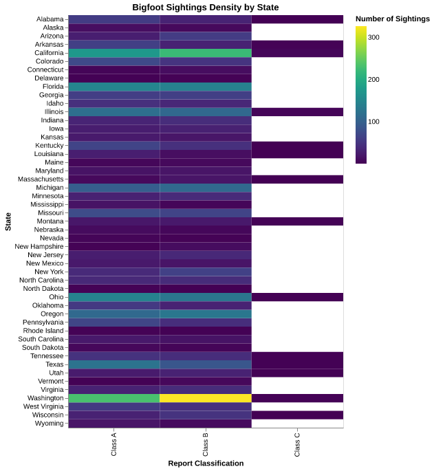
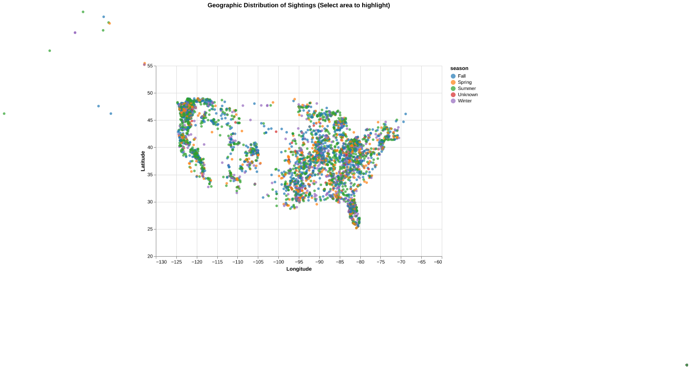

# Bigfoot Sighting Analysis - HW5

This assignment explores the geographic and classification density of Bigfoot sightings using the BFRO dataset. By leveraging visualizations, we can identify patterns in where and how these sightings are reported across North America.

[The Data](https://raw.githubusercontent.com/UIUC-iSchool-DataViz/is445_data/main/bfro_reports_fall2022.csv) | [The Analysis](https://github.com/MichaelChiflikyanBSIS/HW5/blob/main/HW5%20BIGFOOT.ipynb)

---

## Visualization 1: Sighting Classification by State
This heatmap provides a high-level overview of report density across the United States. By categorizing sightings into Class A (clear visual sightings), Class B (incidental evidence like footprints or audio), and Class C (second-hand accounts), we can see which regions have the highest frequency of reports. 

The color scale uses the **Viridis** palette, which is uniform and colorblind-friendly. This allows for an immediate visual assessment of high density regions. For instance, states like Washington and California show significantly deeper saturation across multiple categories.

---

## Visualization 2: Geographic Distribution
While the heatmap shows state-level totals, this scatter plot reveals the precise geographic coordinates of every reported sighting. Each point represents a unique report, mapped by longitude and latitude to show density across the landscape.

The data is encoded by **Season**, using the **Category10** color scheme to differentiate between Summer, Fall, Winter, and Spring. To ensure accuracy, the map is constrained to the continental United States and filters out entries with missing coordinates.

---

### Discussion of Interactivity
In the original Python implementation, I utilized an **interval selection tool** on the geographic plot to allow for deeper exploration. This allowed for clicking and dragging to create a bounding box over specific regions to highlight local seasonal distribution. While these static exports show the overall density, the full interactive capabilities can be explored in the linked analysis notebook.
